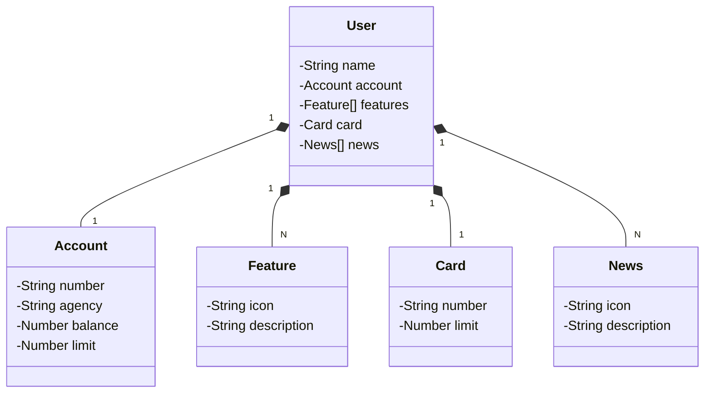

# Implementação de API usando SB3 e Java17

## ***Tecnologias usadas***

- Java 17
- Spring Boot 3
- Spring Data JPA
- OpenAPI (Swwagger)

## ***Diagrama - Domain***

```mermaid
classDiagram

User "1" *-- "1" Account
User "1" *-- "N" Feature
User "1" *-- "1" Card
User "1" *-- "N" News
 
class User {
    -String name
    -Account account
    -Feature[] features
    -Card card
    -News[] news
}

class Account {
    -String number
    -String agency
    -Number balance
    -Number limit
}

class Feature {
    -String icon
    -String description
}

class Card {
    -String number
    -Number limit
}

class News {
    -String icon
    -String description
}
  
```